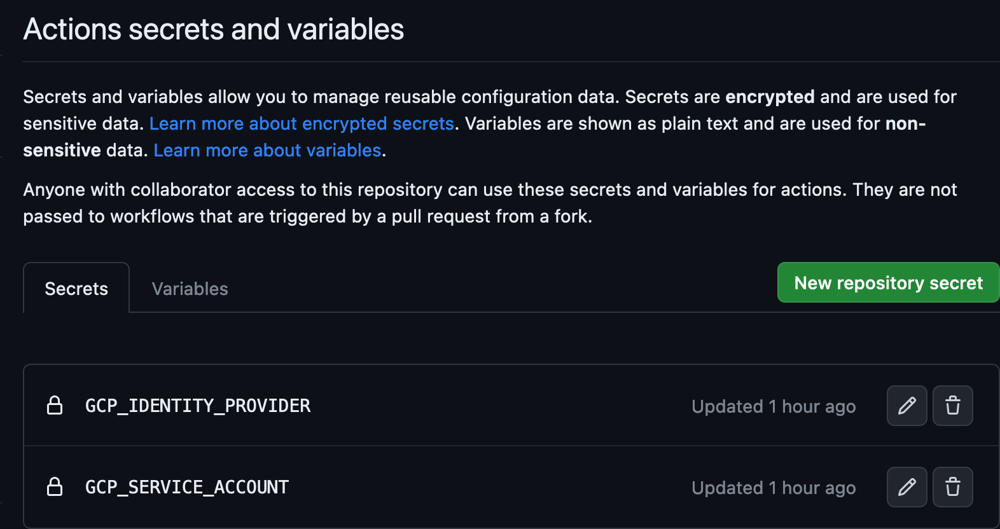
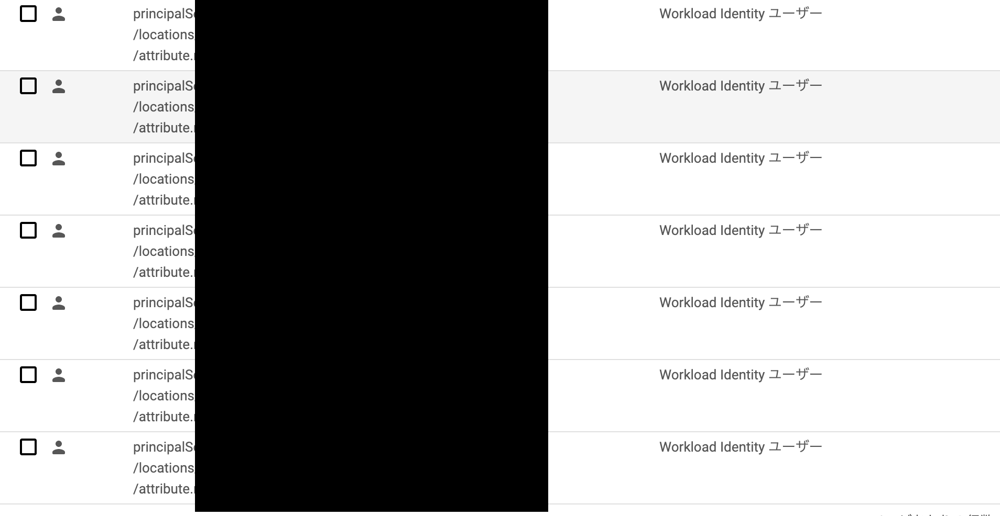
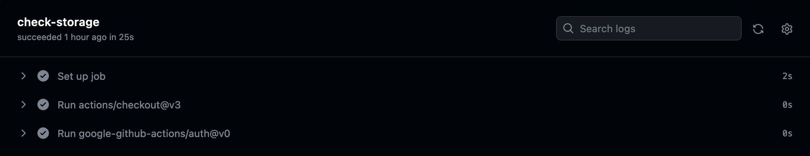

# GCPでGitHub Actions用(OIDC)のサービスアカウントをTerraformで作成する

本記事ではGoogle Cloud Platform上でGitHub ActionsからOIDCで接続できるサービスアカウントをTerraformで作成します。
ついでに、作成した情報をGitHub Actionsのシークレットに登録するところまでTerraformでやります。

## 参考

* https://registry.terraform.io/providers/hashicorp/google/latest
  * https://registry.terraform.io/providers/hashicorp/google/latest/docs/resources/google_service_account
  * https://registry.terraform.io/providers/hashicorp/google/latest/docs/resources/google_service_account_iam
  * https://registry.terraform.io/providers/hashicorp/google/latest/docs/resources/iam_workload_identity_pool
  * https://registry.terraform.io/providers/hashicorp/google/latest/docs/resources/iam_workload_identity_pool_provider
* https://registry.terraform.io/providers/integrations/github/latest
  * https://registry.terraform.io/providers/integrations/github/latest/docs/resources/actions_secret
* https://docs.github.com/ja/actions/deployment/security-hardening-your-deployments/configuring-openid-connect-in-google-cloud-platform
* https://docs.github.com/ja/actions/deployment/security-hardening-your-deployments/about-security-hardening-with-openid-connect
* https://blog.g-gen.co.jp/entry/how-to-use-iam-resources-of-terraform

検証に使用したコードは以下のリポジトリにあります。

https://github.com/k-kojima-yumemi/curly-couscous

## 環境

* Terraform v1.5.3
* gh version 2.31.0 (2023-06-20)
  * メインの部分には関係ありませんが、GitHubのTokenを得るのに使用しています

## Terraformの作成

ここではコードの例を紹介しますが、変数の定義は省略しています。
ある程度推測できる命名にしているので、渡している情報の参考にしてください。
上のリンクのリポジトリには変数の定義を含むコードがあるので、そちらも参照してください。

### 今回作成する構成

GitHubのリポジトリは既存のものを使用します。
Secretsはリポジトリに直接紐付けます。
Secretsに接続に使用するサービスアカウントの情報とidentity providerの情報を登録します。
リポジトリに登録するため、GCP側でもリポジトリのみで認証をするように設定します。

サービスアカウントにはGitHubのリポジトリから使用できるようにWorkload Identityユーザーの権限を登録するところまでやります。

複数のGitHubリポジトリで同じアカウントを使い回すような設計にしていますのでご了承下さい。

### 使用するプロバイダー

```terraform
terraform {
  required_providers {
    google = {
      source  = "hashicorp/google"
      version = "~> 4"
    }
    github = {
      source  = "integrations/github"
      version = "~> 5.0"
    }
  }
}
```

GCPを操作するのでgoogleのプロバイダー、GitHubのリソース作成のためにgithubのProviderを使用します。
GitHubのプロバイダーはdeprecatedになった昔のものを使用しないようにしましょう。
GitHubのリソースを作成するmoduleの中ではterraformブロックを定義して確実に`integrations/github`のモジュールを使わせるようにし、deprecatedになったプロバイダーが混ざることのないようにして下さい。

各Providerの設定は以下のようにしました
```terraform
provider "google" {
  project = var.project_name
  region  = var.project_region
  zone    = var.project_zone
}

provider "github" {
  token = var.gh_token
  owner = var.github_owner
}
```
GCPのプロバイダーにはとりあえずregionやzoneを登録していますが今回作成するリソースには使われていません。
projectには操作するプロジェクトの名前を入れています。(IDの番号ではないです)
GitHubのtokenには `gh auth token` で得られるものを使用しています。
ownerにはリポジトリの所有者を入れています。

### GCPのWorkload Identity 連携の作成

まずはGitHub Actionsから接続するためのOIDCの設定から作成します。

```terraform
resource "google_iam_workload_identity_pool" "pool" {
  workload_identity_pool_id = var.pool_id
  description               = "OpenID Connection"
  display_name              = var.pool_id
  timeouts {}
}

output "workload_identity_pool_name" {
  value = google_iam_workload_identity_pool.pool.name
}

resource "google_iam_workload_identity_pool_provider" "gh_provider" {
  workload_identity_pool_id          = google_iam_workload_identity_pool.pool.workload_identity_pool_id
  workload_identity_pool_provider_id = var.provider_id
  display_name                       = "GitHub Identity Provider"
  disabled                           = false
  oidc {
    issuer_uri        = "https://token.actions.githubusercontent.com"
    allowed_audiences = []
  }
  attribute_mapping = {
    "google.subject"       = "assertion.sub",
    "attribute.actor"      = "assertion.actor",
    "attribute.repository" = "assertion.repository",
  }
  attribute_condition = "attribute.actor == '${var.github_owner}'"
  timeouts {}
}

output "workload_identity_pool_provider_name" {
  value = google_iam_workload_identity_pool_provider.gh_provider.name
}
```
作成するリソースは`google_iam_workload_identity_pool`と`google_iam_workload_identity_pool_provider`の2つです。
providerをまとめるためのpoolと接続の詳細が入っているproviderです。
名前や説明は適当です。
poolの名前もproviderの名前も後で使うのでoutputに指定しています。

providerの方には[GitHubのドキュメント](https://docs.github.com/ja/actions/deployment/security-hardening-your-deployments/configuring-openid-connect-in-google-cloud-platform)で指定されているURLを指定しています。
またリポジトリや実行者の情報を認証に使用できるように設定しています。
認証に使用する属性については[GCPのドキュメント](https://cloud.google.com/iam/docs/workload-identity-federation?hl=ja#conditions)や[GitHubのドキュメント](https://docs.github.com/ja/actions/deployment/security-hardening-your-deployments/about-security-hardening-with-openid-connect)を参照して下さい。

## GCPのサービスアカウントの作成

次にGCP上で操作を行うprincipalであるサービスアカウントを作成します。

```terraform
resource "google_service_account" "account" {
  account_id   = var.iam_id
  display_name = var.iam_name
  description  = "Access from GitHub Actions(${var.github_access_from})"
  disabled     = false
  timeouts {}
}

output "service_account_email" {
  value = google_service_account.account.email
}

resource "google_service_account_iam_policy" "policy" {
  policy_data        = data.google_iam_policy.policy.policy_data
  service_account_id = google_service_account.account.name
}

data "google_iam_policy" "policy" {
  binding {
    members = [
      for s in var.github_repositories :
      "principalSet://iam.googleapis.com/${var.workload_identity_pool_name}/attribute.repository/${s}"
    ]
    role = "roles/iam.workloadIdentityUser"
  }
}
```

サービスアカウント自体は他のリソースの情報を使うことなく作成できます。
このアカウントを使用できる権限の設定にはgoogle_service_account_iam_policyを使用しました。
これで複数のリポジトリから同じアカウントを使い回すための設定の登録ができます。
ここのprincipalの設定でIdentity Poolの名前を使用しています。

サービスアカウントのEmailはGitHub ActionsのSecretsに登録するのでoutputに入れています。

### GitHub ActionsのSecretsの作成

ここではdeprecatedになったプロバイダーを使用しないように気をつけて下さい。
また、github_repositoryはリポジトリが見つからない時nameにnullを入れてくるので、planした際にはよく確認するといいと思います。

```terraform
data "github_repository" "repo" {
  full_name = var.repo_full_name
}

resource "github_actions_secret" "identity_provider" {
  repository      = data.github_repository.repo.name
  secret_name     = "GCP_IDENTITY_PROVIDER"
  plaintext_value = var.workload_identity_pool_provider_name
}

resource "github_actions_secret" "service_account" {
  repository      = data.github_repository.repo.name
  secret_name     = "GCP_SERVICE_ACCOUNT"
  plaintext_value = var.service_account_email
}
```

`GCP_IDENTITY_PROVIDER`と`GCP_SERVICE_ACCOUNT`を登録しています。
今回はSecretsに入れていますが、これが流出しても直ちにアクセスされるわけではないので`plaintext_value`にしています。

`plaintext_value`にした値は`tfstate`ファイルに平文で保存されているのでファイルの扱いには注意して下さい。

## Plan

ここまでの内容で作成したTerraformでterraform planを実行した例を紹介します。
検証に使用したGitHubのリポジトリを対象に実行しています。

```
module.github_secrets["k-kojima-yumemi/curly-couscous"].data.github_repository.repo: Reading...
module.github_secrets["k-kojima-yumemi/curly-couscous"].data.github_repository.repo: Read complete after 0s [id=curly-couscous]

Terraform used the selected providers to generate the following execution
plan. Resource actions are indicated with the following symbols:
  + create
 <= read (data resources)

Terraform will perform the following actions:

  # module.github_secrets["k-kojima-yumemi/curly-couscous"].github_actions_secret.identity_provider will be created
  + resource "github_actions_secret" "identity_provider" {
      + created_at      = (known after apply)
      + id              = (known after apply)
      + plaintext_value = (sensitive value)
      + repository      = "curly-couscous"
      + secret_name     = "GCP_IDENTITY_PROVIDER"
      + updated_at      = (known after apply)
    }

  # module.github_secrets["k-kojima-yumemi/curly-couscous"].github_actions_secret.service_account will be created
  + resource "github_actions_secret" "service_account" {
      + created_at      = (known after apply)
      + id              = (known after apply)
      + plaintext_value = (sensitive value)
      + repository      = "curly-couscous"
      + secret_name     = "GCP_SERVICE_ACCOUNT"
      + updated_at      = (known after apply)
    }

  # module.main_github_identity_pool.google_iam_workload_identity_pool.pool will be created
  + resource "google_iam_workload_identity_pool" "pool" {
      + description               = "OpenID Connection"
      + display_name              = "github-actions-openid-koma"
      + id                        = (known after apply)
      + name                      = (known after apply)
      + project                   = (known after apply)
      + state                     = (known after apply)
      + workload_identity_pool_id = "github-actions-openid-koma"

      + timeouts {}
    }

  # module.main_github_identity_pool.google_iam_workload_identity_pool_provider.gh_provider will be created
  + resource "google_iam_workload_identity_pool_provider" "gh_provider" {
      + attribute_condition                = "attribute.actor == 'k-kojima-yumemi'"
      + attribute_mapping                  = {
          + "attribute.actor"      = "assertion.actor"
          + "attribute.repository" = "assertion.repository"
          + "google.subject"       = "assertion.sub"
        }
      + disabled                           = false
      + display_name                       = "GitHub Identity Provider"
      + id                                 = (known after apply)
      + name                               = (known after apply)
      + project                            = (known after apply)
      + state                              = (known after apply)
      + workload_identity_pool_id          = "github-actions-openid-koma"
      + workload_identity_pool_provider_id = "token-actions-githubusercontent"

      + oidc {
          + allowed_audiences = []
          + issuer_uri        = "https://token.actions.githubusercontent.com"
        }

      + timeouts {}
    }

  # module.main_service_account_github.data.google_iam_policy.policy will be read during apply
  # (config refers to values not yet known)
 <= data "google_iam_policy" "policy" {
      + id          = (known after apply)
      + policy_data = (known after apply)

      + binding {
          + members = [
              + (known after apply),
            ]
          + role    = "roles/iam.workloadIdentityUser"
        }
    }

  # module.main_service_account_github.google_service_account.account will be created
  + resource "google_service_account" "account" {
      + account_id   = "github-actions-koma"
      + description  = "Access from GitHub Actions(k-kojima-yumemi)"
      + disabled     = false
      + display_name = "GitHub Actions koma"
      + email        = (known after apply)
      + id           = (known after apply)
      + member       = (known after apply)
      + name         = (known after apply)
      + project      = (known after apply)
      + unique_id    = (known after apply)

      + timeouts {}
    }

  # module.main_service_account_github.google_service_account_iam_policy.policy will be created
  + resource "google_service_account_iam_policy" "policy" {
      + etag               = (known after apply)
      + id                 = (known after apply)
      + policy_data        = (known after apply)
      + service_account_id = (known after apply)
    }

Plan: 6 to add, 0 to change, 0 to destroy.
```

Applyするとリソースが作成されます。

実験的に、7つのリポジトリに対してPolicyを設定しています。


## GitHub Actionsの実行

検証のため、以下でWorkflowを定義しました。

```yaml
name: Login

on:
  workflow_dispatch:
  push:
    branches: main

jobs:
  check-storage:
    runs-on: ubuntu-latest
    timeout-minutes: 30
    permissions:
      id-token: write
      contents: read
    steps:
      - uses: actions/checkout@v3
      - uses: google-github-actions/auth@v1
        with:
          workload_identity_provider: ${{secrets.GCP_IDENTITY_PROVIDER}}
          service_account: ${{secrets.GCP_SERVICE_ACCOUNT}}
```

checkoutしてからGCPの認証をするだけのWorkflowです。

このように正常に動作することが確認できます。
